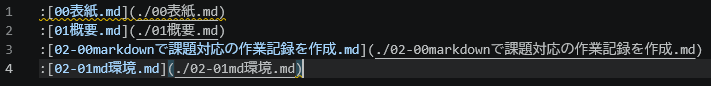
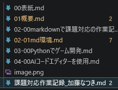
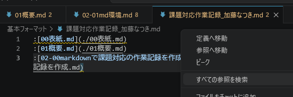
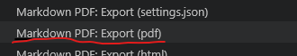
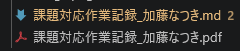

# markdownの作成環境構築、pdf出力確認

作業日:2026年4月1日

***

## VSCodeの拡張機能準備

VSCodeに以下の拡張機能をインストールする
- [Markdown All in One](https://marketplace.visualstudio.com/items?itemName=yzhang.markdown-all-in-one) (v3.6.3)
- [markdownlint](https://marketplace.visualstudio.com/items?itemName=DavidAnson.vscode-markdownlint) (v0.61.2)
- [Markdown PDF](https://marketplace.visualstudio.com/items?itemName=yzane.markdown-pdf) (v1.5.0)

## 作業記録用のmarkdownファイル作成

以下のようにmarkdownで課題対応の作業記録用のファイルを作成する。

```01概要.md
# 課題対応

## 概要

4月1日から次の案件が決まるまでは課題対応となるので、作業記録を作成しながら課題対応を進める。

## 課題

- markdownで課題対応の作業記録を作成する。markdownでのドキュメント作成を身に着ける。
- Pythonでゲーム開発を行う。pythonでの開発スキルを向上させる。
- AIコードエディターを使用する。AIコードエディターがどのようなものか理解する。

## 環境

- [VSCode](https://code.visualstudio.com/) (v1.96)

- markdown
  - [Markdown All in One](https://marketplace.visualstudio.com/items?itemName=yzhang.markdown-all-in-one) (v3.6.2)
  - [markdownlint](https://marketplace.visualstudio.com/items?itemName=DavidAnson.vscode-markdownlint) (v0.57.0)
- pythonゲーム開発
  - Python3
  - [Pyxel](https://github.com/kitao/pyxel) (v2.8.9)

<!-- 改ページ -->
<div class="page"/>
```

## pdfで出力

pdfに出力するための設定ファイルを作成する。



必要なファイルが配置されているのを確認する。



設定ファイルを開いて、右クリックメニューからpdf出力を選択する。




pdfファイルが出力されているのを確認する。



<!-- 改ページ -->
<div style="page-break-after: always;"></div>
