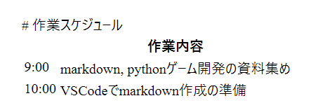

# pdf出力の見出し修正

作業日:2026年4月2日

***

## 問題点

markdownファイルをpdf出力すると、ページの先頭見出しが表示されない。

||
|:-:|

## 対応

改ページ のあとに改行していないのが原因だった。

```
<!-- 改ページ -->
<div style="page-break-after: always;"></div>
★ 改行していないと次のページで先頭の見出しが無効になる。
```

改行を入れると先頭の見出しが表示された。

||
|:-:|

<!-- 改ページ -->
<div style="page-break-after: always;"></div>
