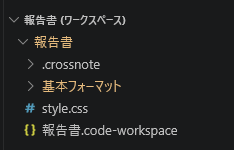

# markdownのpdfにcssスタイルを適用する

作業日:2026年4月2日

***

## 参考

[【Markdown PDF】にCSSを適用する](https://nagominmoon.com/markdown-pdf-css/)

## VSCodeワークスペース設定

ファイル→名前を付けてワークスペースを保存 を選択して、markdownファイルがあるフォルダに保存する。
保存した .code-workspace と同じ階層にスタイル設定用のcssファイルを作成する。



保存した .code-workspace ファイルに参照するcssファイルを設定する。

```
{
	"folders": [
		{
			"path": "."
		}
	],
	"settings": {
		"markdown-pdf.styles": ["./style.css"] ★ 参照するcssファイル
	}
}
```

markdownファイルをpdf出力すると、cssスタイルが設定されている。

||
|:-:|

<!-- 改ページ -->
<div style="page-break-after: always;"></div>
