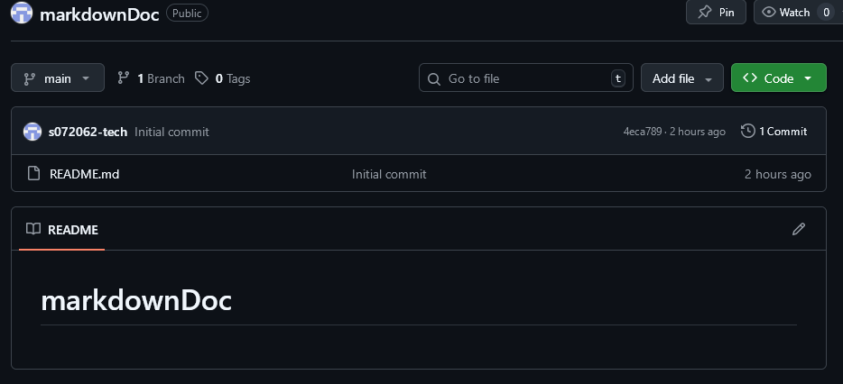
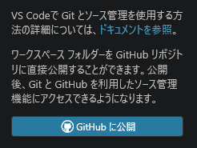

# markdownドキュメントをGitHubで管理する

作業日:2026年4月6日

***

## 概要

markdownのドキュメントはバージョン管理できるのが強みなので、GitHubでバージョン管理できる環境を導入する。

## 参考資料

[VSCodeとGithubの連携](https://breezegroup.co.jp/202102/vscode-github-windows/)
[GitHubのアカウント作成から導入](https://qiita.com/sugijotaro/items/f55d1d955cdda3630797)
[【GitHub×VsCode】基本操作まとめ](https://qiita.com/yuchi0999/items/477a47dffec98a1611b1)

## 環境

 (v2.53.0)

## 作業記録

1. GitHubのアカウントを作成
2. gitインストール
3. リポジトリ作成

   
4. markdownファイルをアップロード

<!-- 改ページ -->

