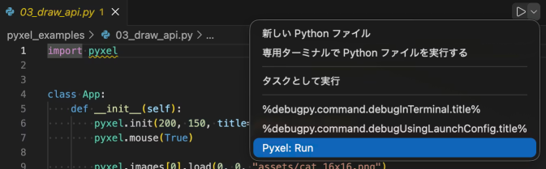
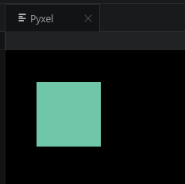
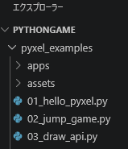

# Pyxelでのゲーム開発準備

## 作業日

2026年4月1日

***

## VSCodeでPyxel開発環境準備

VSCodeに以下の拡張機能をインストールする

- [VSCode Python拡張機能](https://marketplace.visualstudio.com/items?itemName=ms-python.python) (v2026.4.0)
- [VSCode Pyxel拡張機能](https://marketplace.visualstudio.com/items?itemName=kitao.pyxel-vscode) (v0.6.7)

Microsoft StoreからPython3をインストールする
[https://apps.microsoft.com/detail/9pnrbtzxmb4z?hl=ja-JP&gl=JP](https://apps.microsoft.com/detail/9pnrbtzxmb4z?hl=ja-JP&gl=JP)

## Pyxel を使ってみる

基本的なPyxelのコードを作成して実行する。
update で処理を動かし、draw で描画する。

```pyxel_main.py
import pyxel

pyxel.init(160, 120)

def update():
    if pyxel.btnp(pyxel.KEY_Q):
        pyxel.quit()

def draw():
    pyxel.cls(0)
    pyxel.rect(10, 10, 20, 20, 11)

pyxel.run(update, draw)
```

Pythonファイルを選択し、エディタ右上の実行ボタンのドロップダウンから「Pyxel: Run」を実行する。



Pyxelが実行し画面が描画されるのを確認した。



## 公式サンプルのコピー

コマンドパレットからPyxel: Copy Examplesを実行すると、Pyxelの公式サンプルと付属ゲームが選択したフォルダにコピーされる。



<!-- 改ページ -->
<div style="page-break-after: always;"></div>
