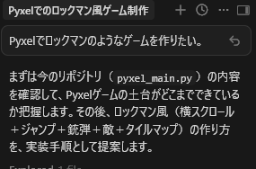
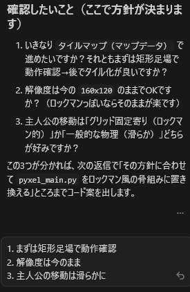
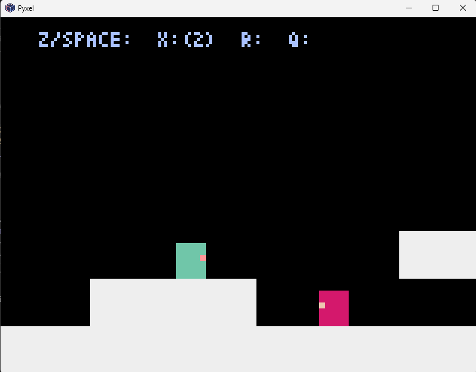

# Cursor 導入

作業日:2026年4月2日

***

## 概要

Pyxelでのゲーム開発にAI機能を導入して、AIを利用した開発を体験する。

## 参考資料

- [Cursorの基礎・活用術](https://qiita.com/sakamoto-ryosuke/items/b440986e53ddb5429ac1)
- [CursorやWindsurfを日本語化する方法](https://qiita.com/k1mu0419/items/2d903660d1f571abb8f2)

## 環境

- [Cursor](https://cursor.com/ja) (v2.6.22)

## Cursorでアクションゲーム作成

以下を参考にCursorをインストール。
[(https://qiita.com/sakamoto-ryosuke/items/b440986e53ddb5429ac1)]((https://qiita.com/sakamoto-ryosuke/items/b440986e53ddb5429ac1))

VSCodeで作成したPyxelの開発環境をCursorで開く。
Cursorのチャットに作りたいゲームの情報を書く。

Cursorが作成するゲームの概要と方針を決めるための質問を出力する。
質問に対して回答を書く。

AIと簡単なチャットをすることで、実際に動かせるアクションゲームの雛形を作ることが出来た。

<!-- 改ページ -->

