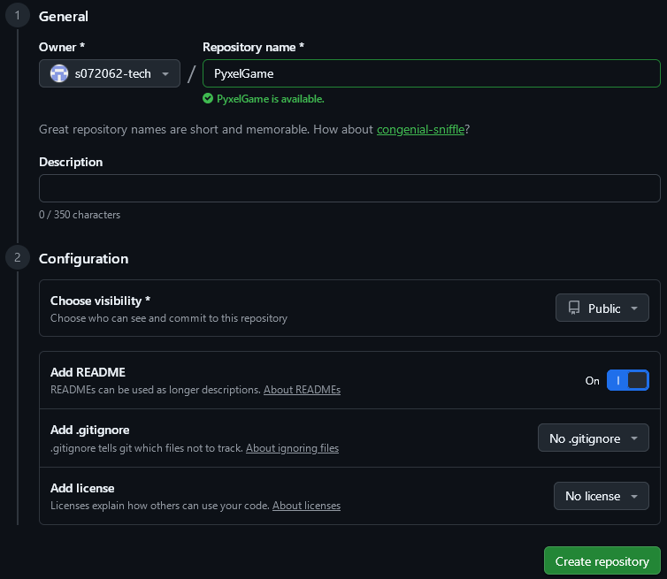

# GitHub連携

作業日:2026年4月6日

***

## 概要

GitHubのリポジトリを作成して、ネット上でPyxelゲームを動かせるようにする。

## 参考資料

- [Pyxelで作ったゲームをネット上に公開しよう！](https://qiita.com/sugijotaro/items/f55d1d955cdda3630797)

## 環境

- 

## 作業記録

1. GitHubのアカウントを作成
2. リポジトリを作成

   設定を Public, Add README有効 にしてリポジトリを作成。
   

3. ファイルをアップロードする
4. webサイトを設定する
5. GitHub Pagesを設定する
6. Pyxelゲームが動くのを確認する

<!-- 改ページ -->

